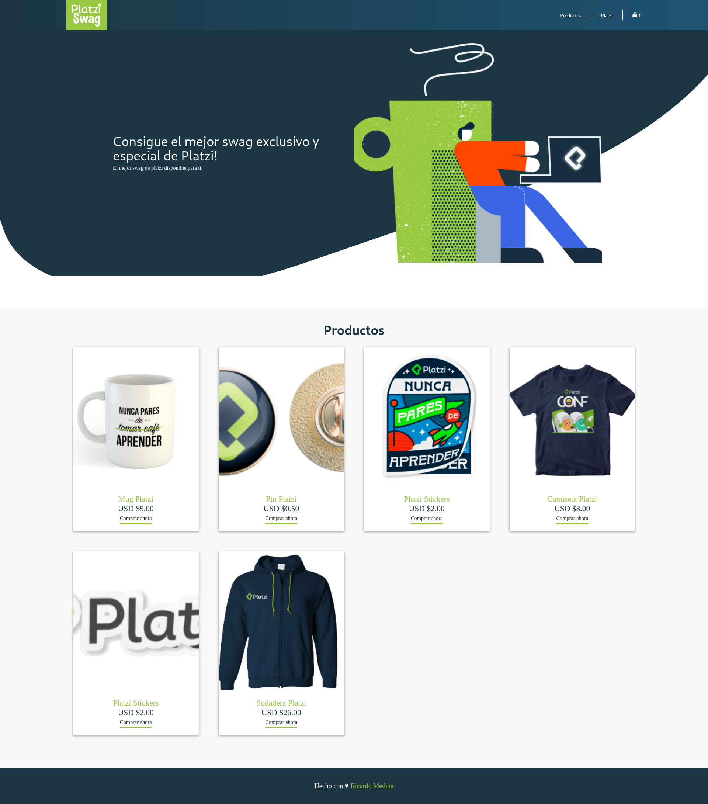

# Platzi Swag

Este repositorio contiene un ecomerce (Platzi Swag) desarrollado con Gatsby JS.

[Ver la aplicación](https://platziswag-ricardo-medina.netlify.com/)

## Cómo funciona?

Requiere Node.JS 10

- `npm install` para instalar las dependencias.
- `npm run develop` para el entorno de desarrollo.
- `npm run build` para el entorno de producción.

## Licencia

MIT
